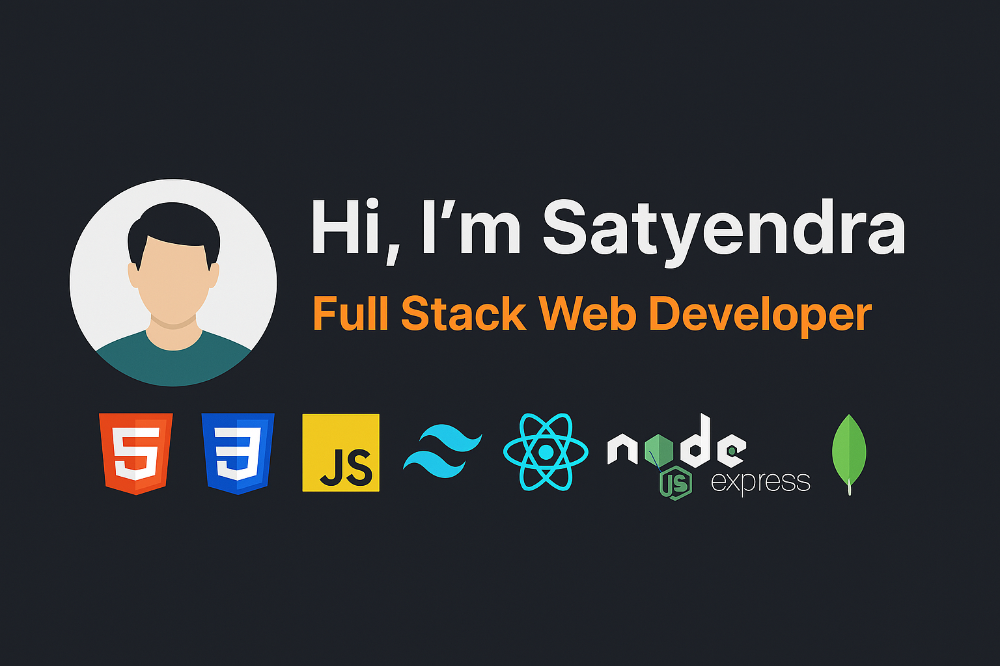

<!-- # 👋 Hi, I'm Satyendra! -->

I'm a passionate **Full Stack Web Developer** who loves building responsive and dynamic web applications. I enjoy solving real-world problems through code and continuously learning new technologies.

---

## 💻 Tech Stack

**Frontend:**
- HTML, CSS, JavaScript
- Tailwind CSS
- React.js (Hooks, State Management)

**Backend:**
- Node.js, Express.js
- MongoDB (Mongoose ODM, Schema Design, CRUD operations)

**Programming Languages:**
- C, C++, Python, Java

---

## 📂 Projects

### 🌐 [LifeOps](https://github.com/Satyendra-official/LifeOps)
- A productivity and lifestyle management app.
- Focused on task tracking, notes, and reminders.
- Built with **MERN stack**, emphasizing clean UI and modular code.

### 💸 [Finance Tracker Backend](https://github.com/Satyendra-official/finance-tracker-backend)
- RESTful API for a personal finance management tool.
- Developed with **Node.js**, **Express**, and **MongoDB**.
- Features: authentication, expense tracking, and robust error handling.

### 🌤️ [React Weather App](https://github.com/Satyendra-official/react-weather-app)
- Real-time weather forecast app using React.
- Integrated OpenWeatherMap API.
- Utilized **React Hooks**, **Tailwind CSS**, and responsive design principles.
  
### 🗃️ Backend API Development
- Developed RESTful APIs using **Node.js** and **Express**.
- Created Mongoose schemas and models to interact with **MongoDB**.
- Focused on efficient data storage, retrieval, and validation.

---

## 📊 GitHub Stats

  
  
  

---

## 🥇 Achievements

- 🎓 Completed full-stack projects using **MERN stack**
- 🌐 Built and deployed a personal portfolio using **Vite + Tailwind**
- 🧠 Learned and implemented API integrations & state management
- 📈 Continuously learning and contributing to open-source projects

---

## 📬 Let's Connect

- 📧 Email: [satyendray2306@gmail.com](mailto:satyendray2306@gmail.com)
- 🐱 GitHub: [github.com/Satyendra-official](https://github.com/Satyendra-official)
- 💼 LinkedIn: [linkedin.com/in/satyendra-kr-yadav](https://www.linkedin.com/in/satyendra-kr-yadav/)

---

> “Code is like humor. When you have to explain it, it’s bad.” – Cory House

Thanks for stopping by! ⭐ Feel free to check out my repositories and leave a star if you like my work!
